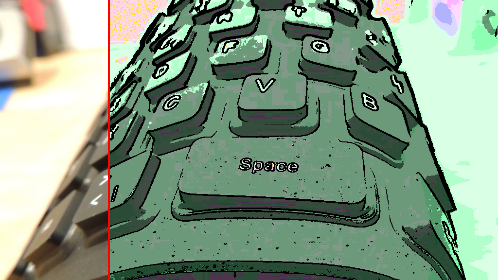

# webgl-postfx-toon 2017.4

A toonify post processing filter. This filter creates a cartoon version of an image. You can use the mouse (the vertical red line) to see the difference between the original and toonified versions of the image.

As usual, this shader can be uesd in webgl with extremely minor changes only. Here are written by two shader language verison, ES 2.0 and ES 3.0.

[online here](https://legend-chen.github.io/webgl-postfx-toon/postfx-toon/index.html) 

### reference:
http://www.geeks3d.com/20140523/glsl-shader-library-toonify-post-processing-filter/

### snapshots:

